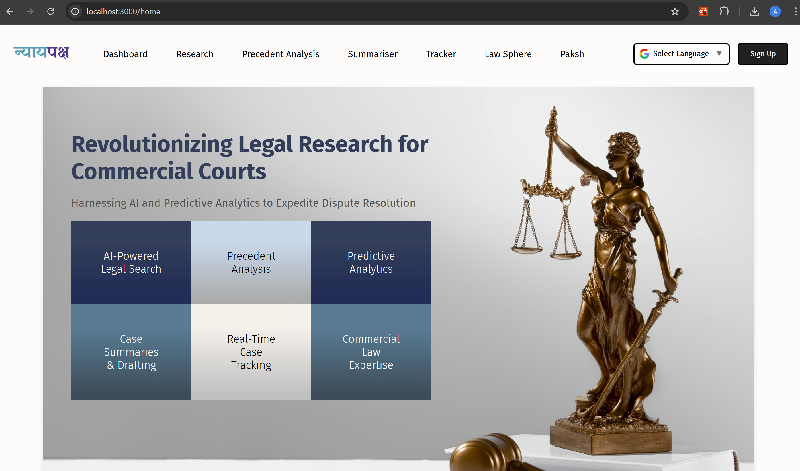
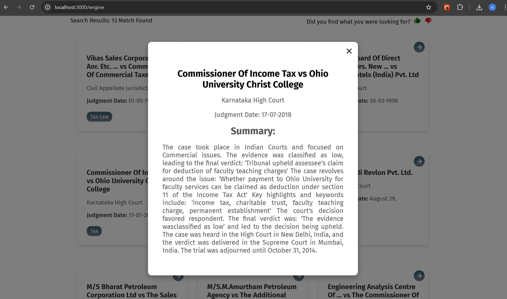
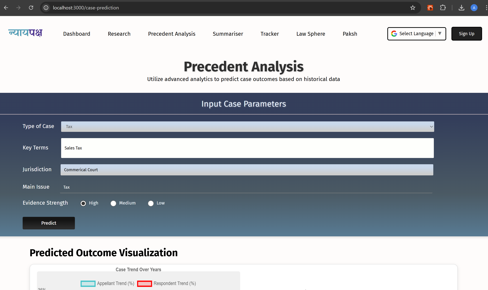
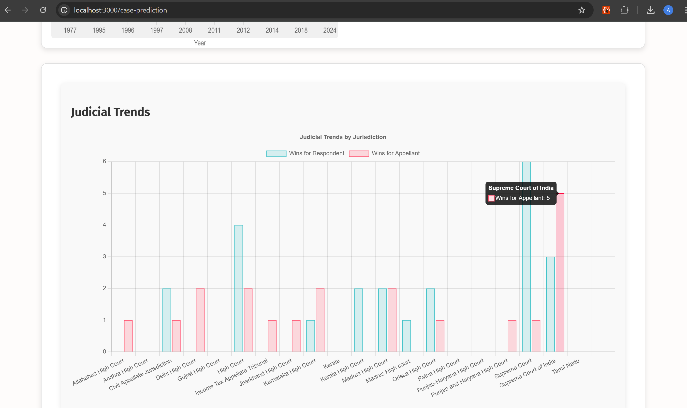
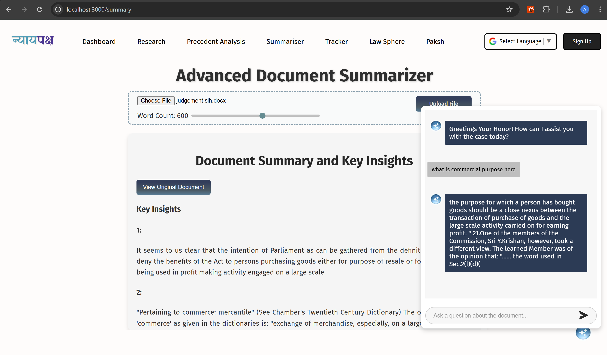
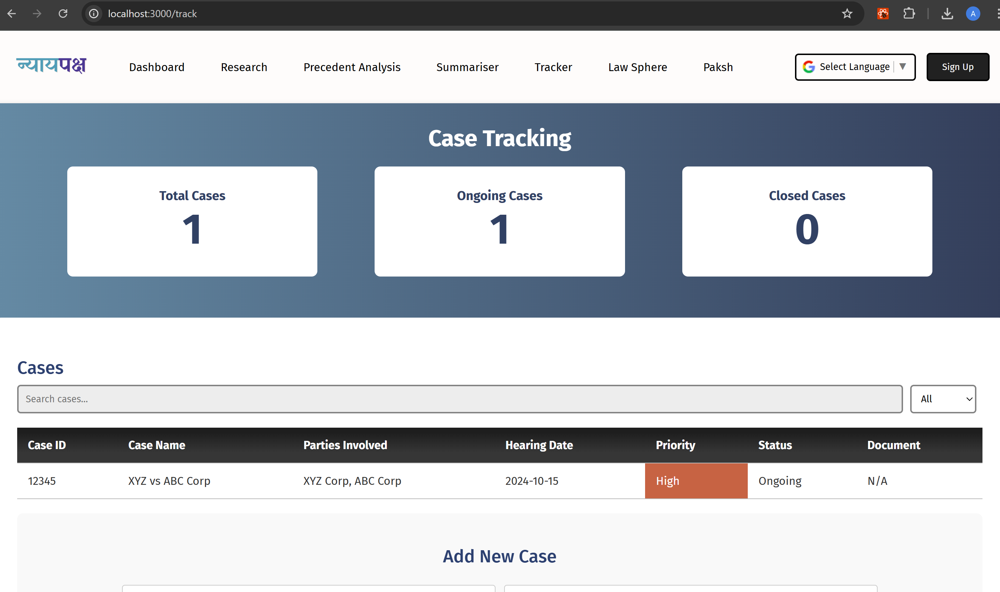
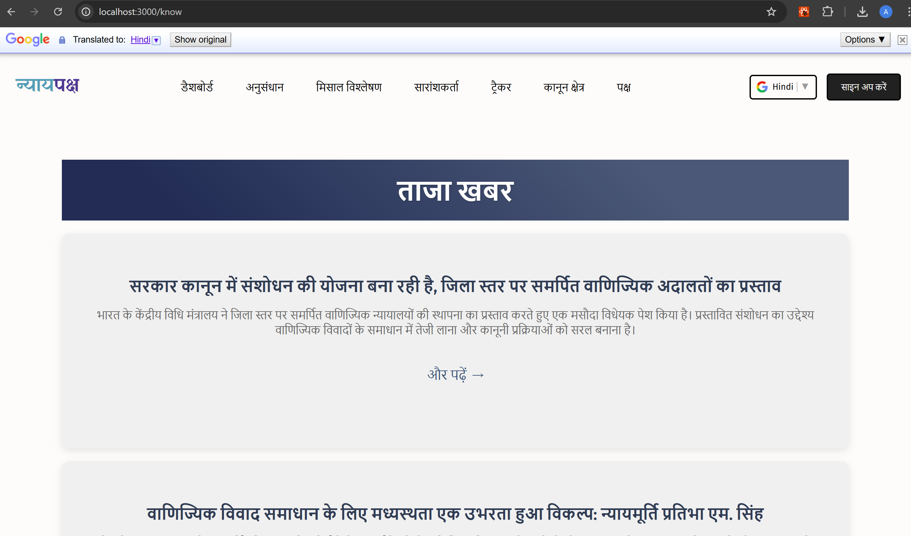

# ⚖️ NyayPaksh – AI-Driven Research Engine for Commercial Courts  
> Developed by **Team InnoVentures**  
> 🏆 **Winner of Smart India Hackathon 2024 – Ministry of Law & Justice**

NyayPaksh is an intelligent, multilingual legal research engine designed to aid commercial courts in **faster dispute resolution**, **predictive legal insights**, and **streamlined decision-making**. It combines AI, NLP, and domain-specific models to reduce backlog and enhance judicial efficiency.

## 🧠 Core Features

### 🔍 AI-Powered Legal Research Engine
- NLP-based contextual search across **500+ curated commercial law precedents**.
- Advanced filters by **jurisdiction, date, issue type, and dispute category**.
- Customizable search output for precise legal queries.

### 📝 Automated Case Summarization
- BERT-based model (Hugging Face) extracts and summarizes case judgments.
- Converts long legal documents into comprehensive summaries in seconds.

### 📊 Precedent & Predictive Analysis Engine
- Outcome forecasting using past case data and AI pattern recognition.
- Graphical trends by **court**, **legal issue**, and **decision history**.
- Factors in **evidence strength and issue relevance**.

### 📂 Comprehensive Case Management
- Real-time **case tracking** with alerts and updates.
- Dashboards for judges and legal researchers to track progress and pending actions.

### 💬 AI Legal Assistant – *Vidhisarathi*
- Chatbot interface for commercial law queries.
- Responds using retrieval-based legal data and language models.

### 🌐 Multilingual Support
- Access legal content in **5 Indian languages** (e.g., Hindi, Tamil, Marathi, Telugu, Bengali).

### 🔐 Authorization
- Google reCAPTCHA integration for bot prevention and form security.
- djwt (JWT for Deno) based token authentication for secure and stateless user sessions.

---

## ⚙️ Tech Stack

| Layer             | Technologies Used                                           |
|------------------|-------------------------------------------------------------|
| Frontend         | **React.js**, Tailwind CSS                                  |
| Backend          | **Node.js**, Python (Flask for ML endpoints)                |
| ML/NLP Models    | Hugging Face Transformers (BERT)                            |
| Database         | **PostgreSQL**                                              |
| Multilingual Support         | Google Translate API                            |
| Chatbot Stack    | LangChain                    |

---

## 🎥 Video Demo

> Watch the full walkthrough of **NyayPaksh** in action:  
**[🔗 Click here to view the demo](https://drive.google.com/file/d/1ZGT5OXCBlg1zrKMS-4ZQxmLL7oMMUif_/view?usp=sharing)**

---

## 🖼️ Feature Screenshots

### 💡 Landing Page

### 🧠 Legal Research & Filtering

### 📊 Precedent Analysis & Prediction

### 💬 Case Summary View & Chatbot – Vidhisarathi

### 📝 Case Tracker

### 🌐 Multilingual Interface

---

## 📈 Impact & Potential

- ⚡ **Faster Legal Research** – Reduced time from hours to seconds.  
- 🧠 **Data-Driven Judiciary** – AI-assisted judgments using precedents.  
- 📉 **Reduced Backlog** – Proactive alerts, summaries, and analytics.  
- 🌏 **Inclusive Access** – Multilingual support for broader legal access.  
- 📊 **Market Potential** – Monetize through analytics reports for firms & think tanks.

---

## 💡 Future Scope

- Integration with **official e-Courts platforms**.
- Expansion to **civil, criminal, and constitutional law domains**.
- Deep integration with **Indian legal taxonomy and gazette archives**.
- Enhancement of **voice-based legal interaction** for vernacular users.

--- 

## 👨‍💻 Team InnoVentures

- Ananya Sharma
- Atreyi Prasad
- Divyanshi Pal
- Aditi Pandit
- Aishwarya
- Aanya Singh

